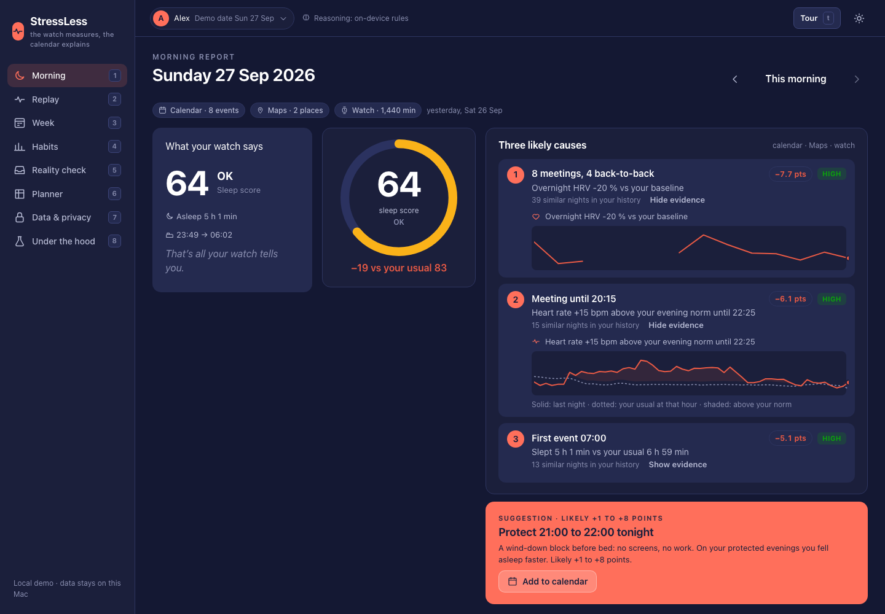
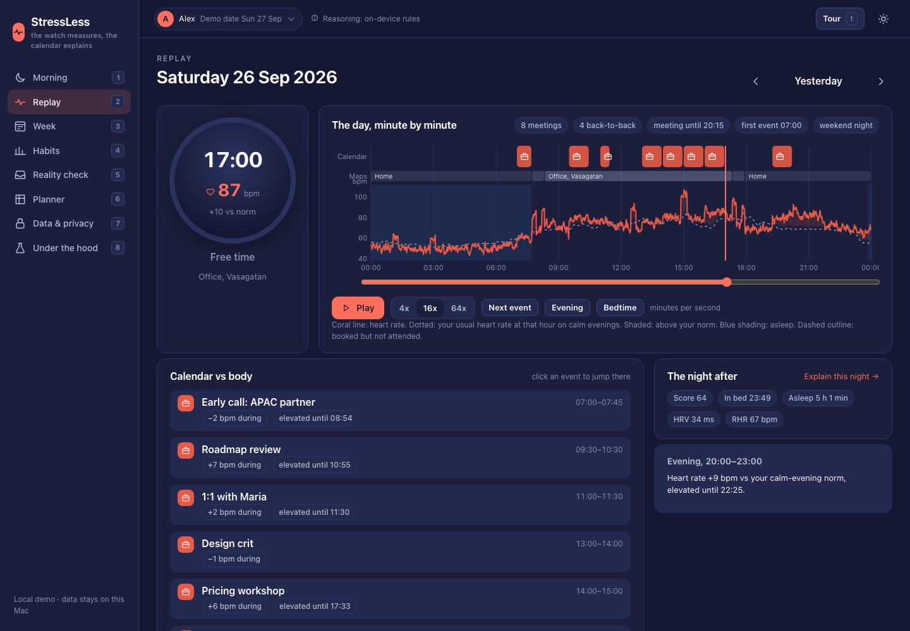
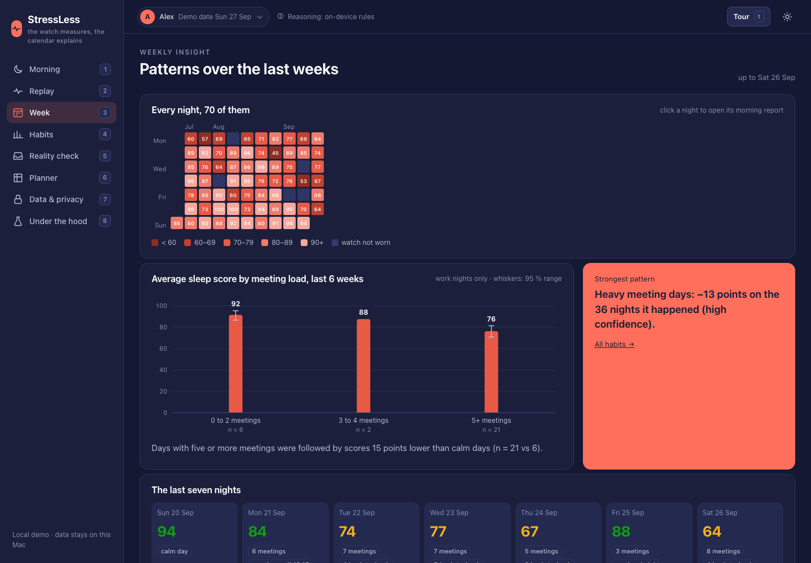
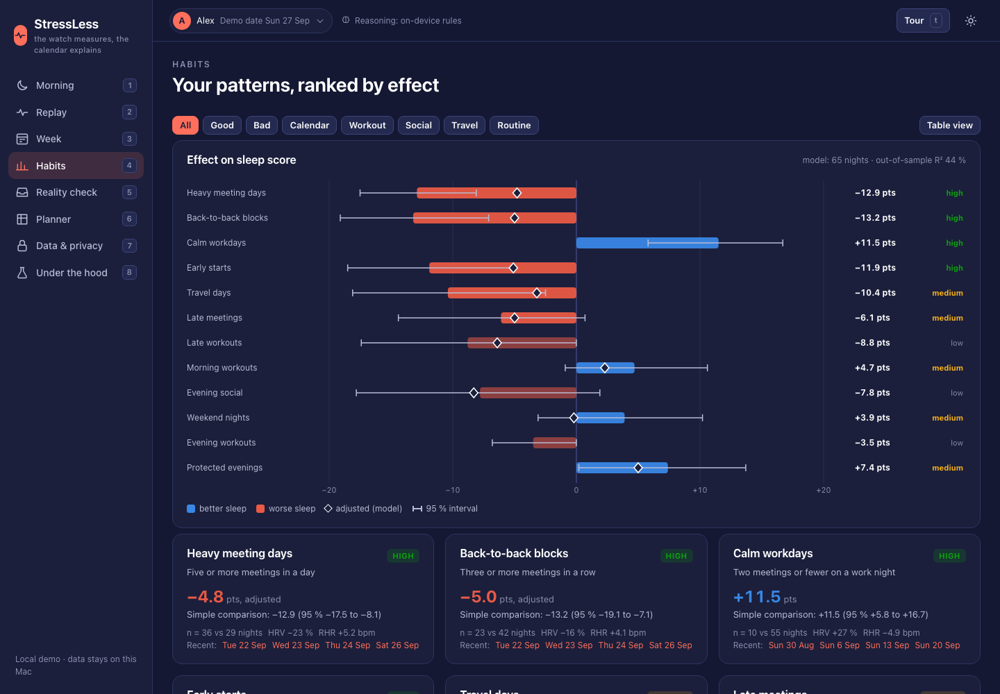
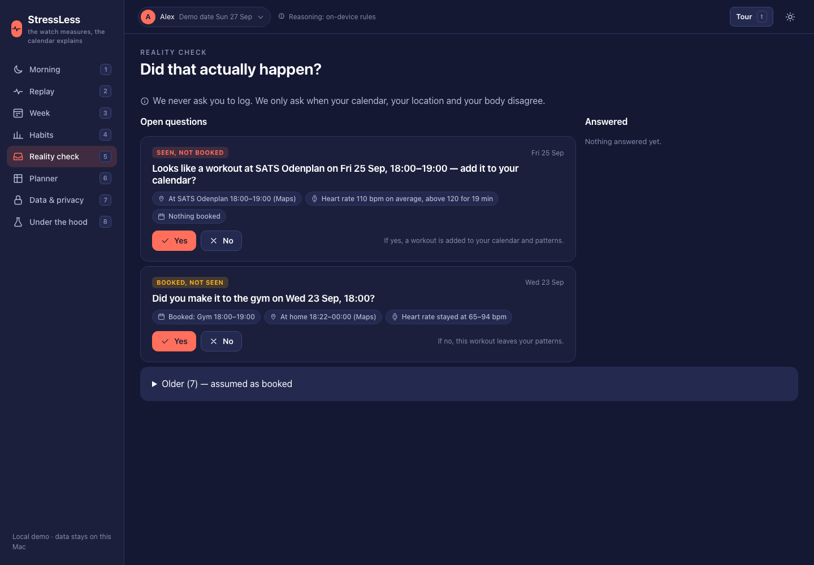
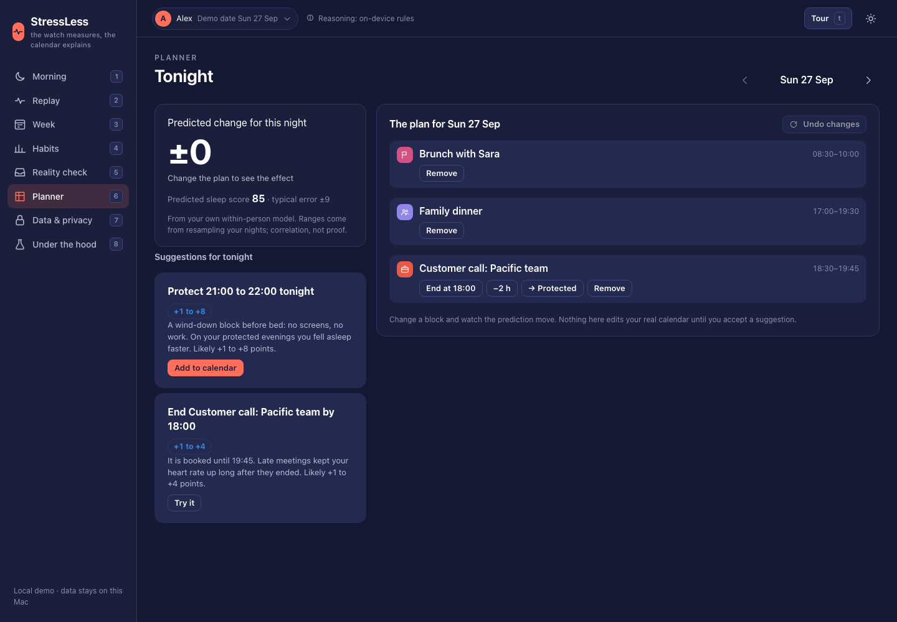
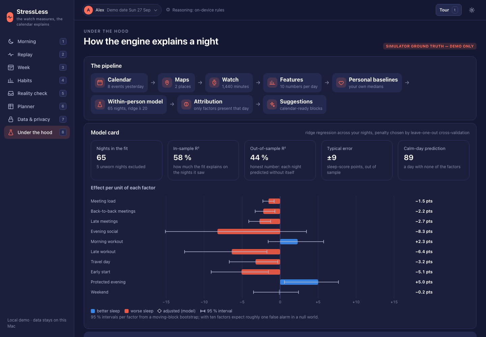
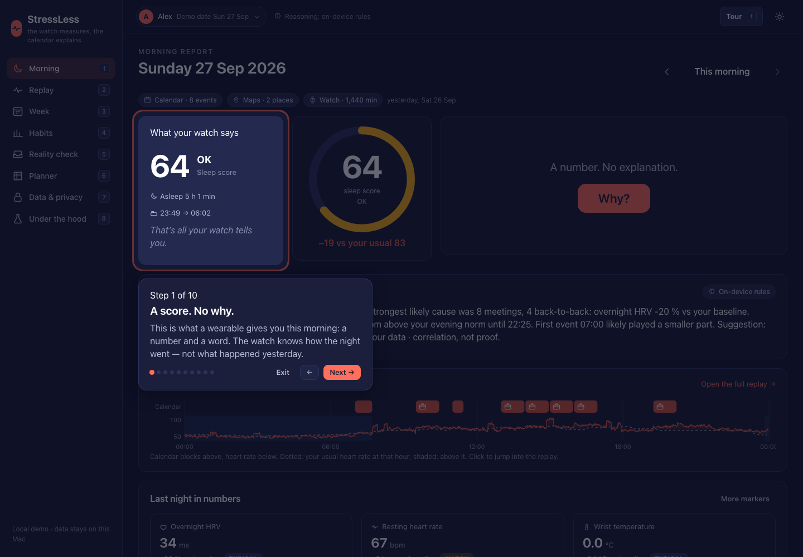

# Project Course DH2465

# StressLess — demo

> Wearables give you a score. They don't tell you why.
> StressLess connects your calendar and your location history to the biometrics your watch already
> collects, and explains what in your day shaped your body and your sleep.

This repository is a **self-contained, offline demo** of the StressLess product. It runs on a Mac with
nothing but the system Python and a browser. Because there is no Apple Watch in the loop yet, the demo
uses a **digital twin**: a simulated person whose calendar, Google Maps history and watch data are
generated from a known causal model. Everything downstream — the explanation engine, the morning
report, reality checks, habits, the planner — is the real product logic, and it runs unchanged on
imported real data (Apple Health export, Google Calendar `.ics`, Google Takeout).

## Quick start

```bash
python3 run.py
```

That generates ten weeks of data on first run, starts a local server on `127.0.0.1:8765`, and opens
your browser. Nothing leaves your machine. Press `Ctrl+C` to stop.

Requirements: macOS with Python 3.9 or newer (`xcode-select --install` provides it) and Chrome or
Safari. No packages to install, no network needed.

## Supabase authentication

The website starts with a Supabase sign-in/register screen. Create a Supabase project, enable email/password authentication, and set the project URL and publishable anon key before starting it:

```powershell
$env:SUPABASE_URL = "https://your-project-ref.supabase.co"
$env:SUPABASE_ANON_KEY = "your-supabase-anon-key"
python src/run.py --no-browser
```

The anon key is intended for browser use when Row Level Security is configured. Never put a Supabase service-role key in this repository or in frontend code. The auth gate is connected now; the existing demo dataset remains local and shared by the running demo until user-scoped Supabase data storage is added.

For team setup, copy `.env.example` to `.env`, fill in the two Supabase values, and run the website normally. `.env` is ignored by Git and is loaded automatically by `src/run.py`.

Before presenting, run the pre-flight check. It builds the engine and asserts that the demo path
exists (a worn last night, three causes, a suggestion, open reality checks, a late meeting today):

```bash
python3 run.py --demo-check
```

## The demo in eight beats

Press `t` (or click **Tour**) to walk these steps with the arrow keys.

1. **Problem.** The Morning view opens like a wearable app: *Score 68 · 6 h 12 min · that's all your
   watch tells you.*
2. **Why?** One click reveals three likely causes with evidence — "Meeting until 20:15: heart rate
   11 bpm above your evening norm until 22:00" — and a suggestion you can put straight into the
   calendar. Click **Add to calendar**.
3. **Replay** (`2`). The day plays back from the evening: heart rate riding above the dotted
   "your usual" line after the late meeting, then bedtime.
4. **Reality check** (`5`). The watch saw a workout the calendar did not know about. Answer **Yes**
   and see the pattern update: *Late workout: −4.1 → −4.6 pts (11 → 10 nights)*.
5. **Week** (`3`). Average sleep score by meeting load over six weeks, and the strongest pattern.
6. **Planner** (`6`). End tonight's 19:30 meeting at 18:00 and watch the predicted score rise, with
   a likely range. The protected block you accepted is already there.
7. **Same engine, different person.** Switch persona in the top bar (Alex → Sam → Robin, under a
   second). Different life, different #1 cause.
8. **Under the hood** (`8`). The engine compared against the planted truth, a planted null factor,
   out-of-sample skill, and everything the calendar cannot see. Drag the cold-start slider to seven
   nights and watch the confidence intervals widen.

Keyboard: `1`–`8` switch views, `←`/`→` change day, `t` tour, `d` light/dark theme (use light on a
bright projector), `?` help.

## Screenshots

| Morning report | Replay |
|---|---|
|  |  |

| Week | Habits |
|---|---|
|  |  |

| Reality check | Planner |
|---|---|
|  |  |

| Under the hood | Presenter tour |
|---|---|
|  |  |

Regenerate them with `python3 run.py --screenshots` (needs Google Chrome).

## What you are looking at

| View | What it shows |
|---|---|
| Morning | Sleep score, three likely causes with evidence, a calendar-ready suggestion, recovery markers (HRV, resting HR, wrist temperature), the night in numbers, and how confident the engine is |
| Replay | A 24-hour timeline: calendar events, where you were (Maps), minute heart rate against your personal norm, sleep; a live watch face while it plays |
| Week | Ten-week score calendar, sleep score by meeting load, strongest pattern, top habits |
| Habits | Every recurring pattern ranked by effect, with intervals, sample sizes and the adjusted (model) effect next to the simple comparison |
| Reality check | Questions asked only when calendar, location and body disagree — booked but not seen, seen but not booked |
| Planner | What-if for today or the coming week; accepted suggestions land in the calendar and as `.ics` |
| Data & privacy | What is connected, which data classes are read and why, persona and seed, importing your own data, delete everything |
| Under the hood | Pipeline, model card (in-sample vs out-of-sample fit), validation against planted truth, hidden factors, why this is not circular, cold-start slider, open challenges |

## How the engine works (and what it does not claim)

1. **Features.** Each day's calendar becomes a handful of numbers: meetings beyond three, longest
   back-to-back chain, hours a meeting ran past 18:00, evening social, morning or late workout,
   travel, early start, protected evening. Events you said you did not attend are excluded.
2. **Personal baselines.** Every biometric is compared with your own recent nights (robust median and
   spread), never with population norms.
3. **Within-person model.** A ridge regression across your nights, with the penalty chosen by
   leave-one-out cross-validation. The footer reports the *out-of-sample* share of night-to-night
   variation the calendar explains, not the flattering in-sample number.
4. **Attribution.** Only factors present on that day are listed; each contribution is the model's
   effect for that factor, with a block-bootstrap interval and a confidence badge that depends on how
   many similar nights exist.
5. **Evidence.** Each cause is backed by what the watch measured: heart rate above your evening norm
   after a late meeting, HRV below baseline after a heavy day, bedtime later than usual after dinner.
6. **Honesty.** When a night is worse than the calendar predicts, the report says so and names the
   things a calendar cannot see: alcohol, caffeine, screens, sleep debt, illness. The Lab shows how
   often those hidden factors occurred in the simulation and how often the engine flagged them.

This is correlation from one person's data. The product says "was followed by" and "is associated
with", never "caused".

## Personas

| | Alex | Sam | Robin |
|---|---|---|---|
| | Product lead who lives by the calendar | Consultant: eight meetings and a flight | Founder: late nights and late workouts |
| Signature bad day | Six meetings, four back-to-back, a call until 20:15 | Flight home plus a client dinner | Investor update at 19:00, gym at 20:45 |

Same seed, same anchor date, same data — every time. Change them with `--seed` and `--anchor`.

## Bring your own data

```bash
python3 run.py --import-health ~/Downloads/apple_health_export/export.xml \
               --import-ics ~/Downloads/calendar.ics \
               --import-timeline ~/Downloads/Takeout/Location\ History \
               --persona-name "Nima"
```

Apple Health: Settings → Health → Export All Health Data. Google Calendar: Settings → Import & export
→ Export. Google Maps: Google Takeout → Location History (both the monthly Semantic Location History
files and the newer `Timeline.json` are supported). The engine, views and reality checks work exactly
as in the demo; the Lab's planted-truth panels are hidden because there is no planted truth.

## Optional: Claude writes the narrative

The narrative on the Morning view is written by an on-device rule-based reasoner by default. If you
have a Python with the `anthropic` package and credentials configured, you can let Claude write it:

```bash
STRESSLESS_REASONER=claude /path/to/python3 run.py
```

Only a de-identified summary is sent (score, causes, evidence text, sample size — never event ids,
times, locations or attendees). The model defaults to `claude-opus-5`; override with
`STRESSLESS_CLAUDE_MODEL`. Server-side refusal fallbacks are enabled by default. On any error the app
falls back to the rule-based reasoner, and the reasoner badge in the top bar always tells you which one
wrote the text.

## Command line

```bash
python3 run.py                                  # run the demo
python3 run.py --persona sam --seed 3 --regenerate
python3 run.py --anchor 2026-09-27              # freeze "today"
python3 run.py --report today                   # print this morning's report in the terminal
python3 run.py --demo-check                     # pre-flight checklist
python3 run.py --test                           # run the test suite
python3 run.py --screenshots                    # render every view with headless Chrome into docs/screenshots
python3 run.py --no-browser --port 9000         # serve without opening a browser
```

## Project layout

```
run.py                 entry point and CLI
stressless/
  models.py            shared data model (dataclasses, JSON round-trip)
  timeutil.py          time conventions (nights, day-relative hours)
  sim/                 the digital twin: personas, calendar, location, physiology, sleep score, showcase
  connectors/          Apple Health, .ics and Google Takeout importers; demo sources
  store/               sqlite persistence for the dataset, answers and accepted suggestions
  engine/              features, baselines, matching, reality checks, attribution, habits, what-if,
                       suggestions, reasoning, pipeline
  server/              localhost HTTP server and JSON API
web/                   vanilla HTML/CSS/JS frontend (no build step)
tests/                 unittest suite
tools/                 headless-Chrome screenshots and palette validation
```

## Known limitations

* One person's data: correlation, not proof — and the app says so on every report.
* The simulator is a caricature of a life. It is honest about its causal model (see Under the hood),
  but it is not a physiological model.
* The DST change night is off by one hour in durations.
* The calendar misses coffee, alcohol, screens and unbooked stress; the demo shows how the product
  copes with that rather than pretending otherwise.
